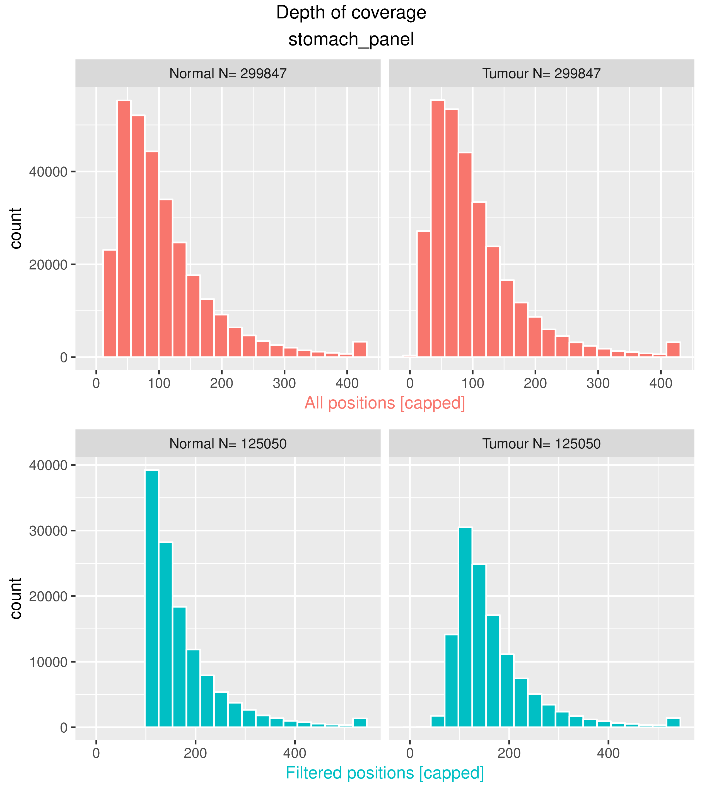
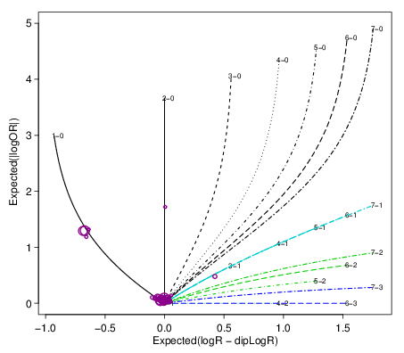

[](http://bioconda.github.io/recipes/cnv_facets/README.html)
[](https://travis-ci.org/wwcrc/cnv_facets)
[](https://codecov.io/gh/wwcrc/cnv_facets/branch/master)
[](https://cran.r-project.org/)
[](https://github.com/wwcrc/cnv_facets)

Detect somatic copy number variants (CNV) in tumour-normal samples using the
[facets](https://github.com/mskcc/facets) package

<!-- vim-markdown-toc GFM -->

* [Purpose](#purpose)
* [Quick start](#quick-start)
* [Requirements and Installation](#requirements-and-installation)
    * [Install via bioconda (recommended)](#install-via-bioconda-recommended)
    * [Install via setup script](#install-via-setup-script)
* [Input](#input)
    * [Option 1: BAM & VCF input](#option-1-bam--vcf-input)
    * [Option 2: Pileup input](#option-2-pileup-input)
* [Output](#output)
    * [Variants](#variants)
    * [CNV profile plot](#cnv-profile-plot)
    * [Histograms of depth of coverage](#histograms-of-depth-of-coverage)
    * [Diagnostic plot](#diagnostic-plot)
    * [Pileup file](#pileup-file)
* [Usage guidelines](#usage-guidelines)
    * [Command options](#command-options)
    * [Filtering output for relevant CNVs](#filtering-output-for-relevant-cnvs)
* [Time and memory footprint](#time-and-memory-footprint)
* [Citation](#citation)

<!-- vim-markdown-toc -->

Purpose
=======

*cnv_facets* detects somatic copy number variants (CNVs), *i.e.*, variants
private to a tumour sample given a matched or unmatched normal sample.
*cnv_facets* uses next generation sequencing data from **whole genome (WGS)**,
**whole exome (WEX)** and **targeted (panel)** sequencing experiments. In
addition, it estimates tumour purity and ploidy. 

The core of *cnv_facets* is the
[facets](https://github.com/mskcc/facets) package by R Shen and VE Seshan
[FACETS: allele-specific copy number and clonal heterogeneity analysis tool for
high-throughput DNA sequencing, *Nucleic Acids Res*, 2016](https://www.ncbi.nlm.nih.gov/pmc/articles/PMC5027494/)

The advantage of *cnv_facets* over the original
[facets](https://github.com/mskcc/facets) package is the convenience of
executing all the necessary steps, from BAM input to VCF output, in a single
command line call.

Quick start
===========

Install with [bioconda](https://bioconda.github.io/recipes/cnv_facets/README.html)

```
conda install cnv_facets
```

Detect CNVs:

```
cnv_facets.R -t <tumour.bam> -n <normal.bam> -vcf <snps.vcf.gz> -o <output_prefix>
```

Get help:

```
cnv_facets.R -h
```

Requirements and Installation
=============================

`cnv_facets` runs on the Linux operating system. Windows is not supported 
and MacOS could work but some tweaks are necessary.

Install via bioconda (recommended)
----------------------------------

Installation via the [conda](https://conda.io/docs/) package manager is the
recommended route. Options `-c bioconda -c conda-forge` can be omitted if
bioconda and conda-forge are already registered channels (see below):

```
conda install -c bioconda -c conda-forge cnv_facets
```

If the above fails with `conda: command not found` or similar, install conda first.
Follow the official
[documentation](https://conda.io/docs/user-guide/install/linux.html) but
basically, these commands should suite most users:

```
# See https://conda.io/miniconda.html
wget https://repo.anaconda.com/miniconda/Miniconda3-latest-Linux-x86_64.sh

# Run and follow the prompt on screen
bash Miniconda3-latest-Linux-x86_64.sh

# Add some useful package repositories
conda config --add channels defaults
conda config --add channels bioconda
conda config --add channels conda-forge
```

Install via setup script
------------------------

*cnv_facets* requires a reasonably recent version of
[R](https://cran.r-project.org/) on a Linux operating system. At the time of
this writing, it has been developed and deployed on R 3.5 on CentOS 7.

To compile and install execute:

```
bash setup.sh --bin_dir </dir/on/path>
```

Where `/dir/on/path` is a directory on your PATH where you have permission to
write, *e.g.*, `~/bin`.

Input
=====

Option 1: BAM & VCF input
-------------------------

Required input files:

* A bam file of the **tumour** sample

* A bam file of the **normal** sample (typically, a blood
  sample from the same patient)

* A VCF file of common, polymorphic SNPs. For human samples, a good source is
  the dbSNP file
  [common_all.vcf.gz](https://www.ncbi.nlm.nih.gov/variation/docs/human_variation_vcf/). 
  See also NCBI [human variation sets in VCF Format](https://www.ncbi.nlm.nih.gov/variation/docs/human_variation_vcf/).

**USAGE**

```
cnv_facets.R -t <tumour.bam> -n <normal.bam> -vcf <snps.vcf.gz> -o <output_prefix> [...]
```

Option 2: Pileup input
----------------------

This pileup file is generated by `cnv_facets.R` when run with bam input as in
option 1. If you need to explore different parameter values for CNV detection, 
using a pre-made pileup file can save considerable computing time.

Internally, `cnv_facets.R` uses `snp-pileup`, a program installed together
with the *cnv_facets* package.

The pileup is a comma separated file of read counts for the reference and
alternate allele at polymorphic SNPs. This file must have the following columns
(order of columns is not important, additional columns are ignored):
 
 * *Chromosome* Chromosome of the SNP
 
 * *Position* Position of the SNP
 
 * *File1R* Read depth supporting the REF allele in **normal** sample
 
 * *File1A* Read depth supporting the ALT allele in **normal** sample
 
 * *File2R* Read depth supporting the REF allele in **tumour** sample
 
 * *File2A* Read depth supporting the ALT allele in **tumour** sample

These are the first lines of the test file `test/data/stomach.csv.gz`
accompanying the original facets package:

```
"Chromosome","Position","Ref","Alt","File1R","File1A","File1E","File1D","File2R","File2A","File2E","File2D"
1,69424,N,N,170,117,0,0,158,103,0,0
1,69515,N,N,0,76,0,0,0,77,0,0
1,69536,N,N,103,0,0,0,99,0,0,0
1,808866,N,N,96,0,0,0,133,0,0,0
1,809120,N,N,66,0,0,0,105,0,0,0
```

**USAGE**

```
cnv_facets.R -p <pileup.csv.gz> -o <output_prefix> [...]
```

Output
======

The option `--out/-o <prefix>` determines the name and location of the output
files. For more information refer to the documentation of the
[facets](https://github.com/mskcc/facets) package.

Variants
--------

* `<prefix>.vcf.gz`

VCF file compressed and indexed of copy number variants. The INFO tags below annotate each variant:

Tag | Type | Description
----|------|------------
SVTYPE | String | Type of structural variant
SVLEN | Integer | Difference in length between REF and ALT alleles
END | Integer | End position of the variant described in this record
NUM_MARK | Integer | Number of SNPs in the segment
NHET | Integer | Number of SNPs that are deemed heterozygous
CNLR_MEDIAN | Float | Median log-ratio (logR) of the segment. logR is defined by the log-ratio of total read depth in the tumor versus that in the normal
CNLR_MEDIAN_CLUST | Float | Median log-ratio (logR) of the segment cluster. logR is defined by the log-ratio of total read depth in the tumor versus that in the normal
MAF_R | Float | Log-odds-ratio (logOR) summary for the segment. logOR is defined by the log-odds ratio of the variant allele count in the tumor versus in the normal
MAF_R_CLUST | Float | Log-odds-ratio (logOR) summary for the segment cluster. logOR is defined by the log-odds ratio of the variant allele count in the tumor versus that in the normal
SEGCLUST | Integer | Segment cluster to which the segment belongs
CF_EM | Float | Cellular fraction, fraction of DNA associated with the aberrant genotype. Set to 1 for normal diploid
TCN_EM | Integer | Total copy number. 2 for normal diploid
LCN_EM | Integer | Lesser (minor) copy number. 1 for normal diploid
CNV_ANN | String | Annotation features assigned to this CNV

The header of the VCF file also stores the estimates of tumour purity and
ploidy and the average insert size of the normal library if using paired-end
BAM input.

CNV profile plot
----------------

* `<prefix>.cnv.png`

Summary plot of CNVs across the genome, for [example](./docs/tex.cnv.png):


Histograms of depth of coverage
------------------------------

* `<prefix>.cov.pdf`

Histograms of the distribution of read depth (coverage) across all the position
in the tumour and normal sample, before and after filtering positions. These
plots are useful to assess whether the sequencing depth and depth of covarage
thresholds are appropriate.



Diagnostic plot
---------------

* `<prefix>.spider.pdf`

This is a diagnostic plot to check how well the copy number fits
work The estimated segment summaries are plotted as circles
where the size of the circle increases with the number of loci in
the segment. The expected value for various integer copy number
states are drawn as curves for purity ranging from 0 to 0.95. For
a good fit, the segment summaries should be close to one of the
lines. (*Description from `facets::logRlogORspider`*). For [example](./docs/tex.spider.png):



Pileup file
-----------

* `<prefix>.csv.gz`

File of nucleotide counts at each SNP in normal and tumour sample.

Usage guidelines
================

Command options
---------------

* `--depth`

Use the histograms of depth to set appropriate thresholds. Consider also the option
`--targets` for targeted sequence libraries.

* `--cval`

Critical values for segmentation in pre-processing and processing.
Larger values reduce segmentation. [25 150] is facets default based on exome data. For whole genome
consider increasing to [25 400] and for targeted sequencing consider reducing them. Default 25 150

* `--nbhd-snp`

If an interval of size nbhd-snp contains more than one SNP, sample a random one.
This sampling reduces the SNP serial correlation. This value should be similar
to the median insert size of the libraries. 250 is facets default based on
exome data. For whole genome consider increasing to 500 and for target
sequencing decrease to 150. Default 250

Filtering output for relevant CNVs 
----------------------------------

* CNLR_MEDIAN_CLUST

USe this VCF tag to filter for records where the difference in read depth
coverage between tumour and normal. The tag `CNLR_MEDIAN` should be well
correlated with `CNLR_MEDIAN_CLUST` so using one or the other should not make
much difference. Use the plot of CNV profile, log-ratio panel of
`<prefix>.cnv.png` to decide on a sensible thresholds.

* MAF_R_CLUST

Use this VCF tag to filter for CNVs significant difference in tumour allele
frequency. Use the plot of CNV profile, log-odds-ratio panel of `<prefix>.cnv.png`
to decide on a sensible thresholds. As above MAF_R_CLUST is correlated with MAF_R.

Time and memory footprint
=========================

The analysis of a whole genome sequence where the
tumour is sequenced at ~80x (~2 billion reads, BAM file ~200 GB) and the normal
at ~40x (~1 billion reads, BAM files ~100 GB) with ~37 million SNPs (from dbSNP
`common_all_20180418.vcf.gz`) and with no filtering on read depth and read
quality requires:

* 5 hours to prepare the SNP pileup with small memory footprint. Time is mostly
  driven by the size of the BAM files. To speed-up the pileup consider the 
  option `--ncores` to parallelize across chromosomes.

* 1 hour and ~15 GB of memory for the actual detection of CNVs starting from
  the pileup. Time and memory is mostly driven by the number of SNPs

Citation
========

If using *cnv_facets* please cite 

* the URL of this repository and 

* The publication of the facets package [FACETS: allele-specific copy
  number and clonal heterogeneity analysis tool for high-throughput DNA
  sequencing, *Nucleic Acids Res*,
  2016](https://www.ncbi.nlm.nih.gov/pmc/articles/PMC5027494/)
